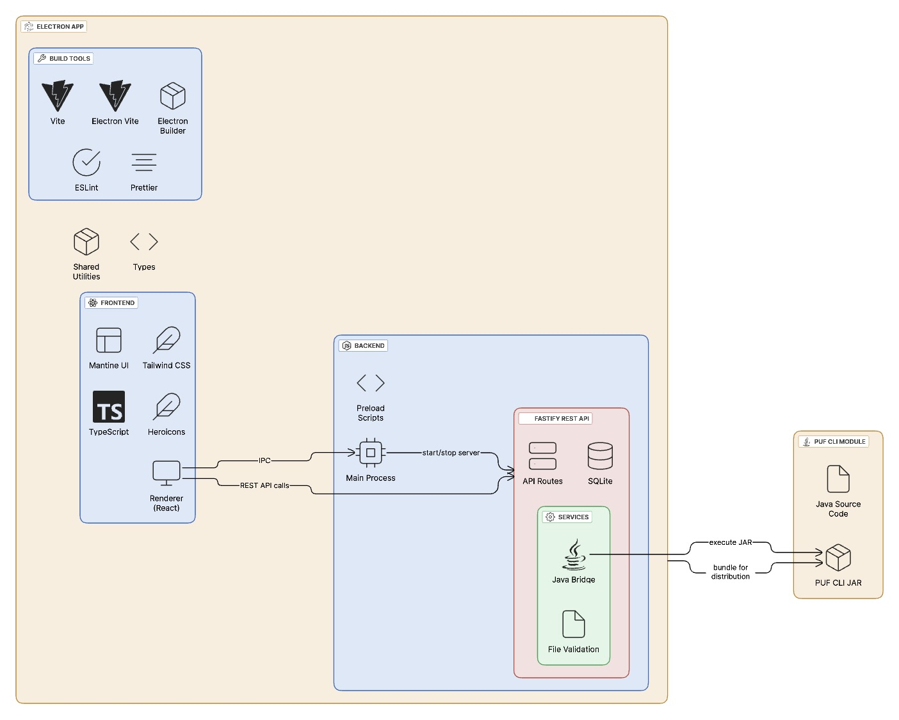

# PUF Analyzer Desktop

A modern Electron desktop application for PUF (Physically Unclonable Function) analysis.



## Tech Stack

- **Frontend**: React 18+, TypeScript, Tailwind CSS, Mantine UI, heroicons
- **Backend**: Electron, Node.js, SQLite (better-sqlite3), Fastify REST API
- **PUF Analysis**: Java CLI bridge for dram-puf-cli operations
- **Build Tools**: Vite, electron-vite, electron-builder
- **Development Tools**: ESLint, Prettier

## Prerequisites

- **Node.js**: v18+ (tested with v20.18.3)
- **pnpm**: v8+ (tested with v8.9.0) 
- **Java**: OpenJDK 11+ (required for PUF analysis)
- **Maven**: v3.8+ (tested with v3.9.9)

### Java Setup (Required for PUF Operations)
```bash
# Install Java 11 via Homebrew (macOS)
brew install openjdk@11

# Set environment (add to ~/.zshrc or ~/.bashrc)
export JAVA_HOME=/opt/homebrew/opt/openjdk@11
export PATH="/opt/homebrew/opt/openjdk@11/bin:$PATH"
```

## Installation

1. Clone the repository:
```bash
git clone
cd puf-desktop-gui
```

2. Build Java CLI (required first):
```bash
cd ../dram-puf-cli
mvn clean package
```

3. Install Node.js dependencies:
```bash
cd ../puf-desktop-gui  
pnpm install
```

4. Build Electron app:
```bash
pnpm build
```

## Development

Start the development server:

```bash
pnpm dev
```

This will:
- Start the Electron main process
- Launch the React development server
- Enable hot reload for both processes
- Open the application window

## Build

### Build for Development
```bash
pnpm build
```

### Package for Distribution
```bash
pnpm package
```

This will create distributable packages in the `dist-electron` directory.

## PUF Backend API

Local REST server for PUF analysis operations. Auto-starts with app, fully offline.

### Endpoints
- POST /api/metrics/analyze - Run PUF metrics analysis  
- POST /api/stable/generate - Generate stable positions
- POST /api/extract/key - Extract keys from dumps
- POST /api/convert/binary - Convert binary data formats
- POST /api/files/upload - Upload and validate files
- GET /docs - Swagger documentation UI

### File Format
Binary strings (0/1), 32 chars/line, .txt/.bin/.pos extensions
Examples: tiva_original_26181245.txt, stellaris1_26183504.txt

### Usage  
Backend auto-starts with app at localhost:PORT
Access docs at /docs endpoint for API testing
Java CLI operations bridged via child_process execution

## Preliminary Project Structure

```
src/
├── main/                 # Main process code
│   ├── index.ts         # Main process entry point
│   ├── ipc/             # IPC handlers
│   └── api/             # REST API server
│       ├── server.ts    # Fastify server setup
│       ├── routes/      # API endpoints
│       ├── services/    # Java CLI bridge & file validation
│       ├── dto/         # Request/response types
│       └── middleware/  # Validation & error handling
├── renderer/            # Renderer process code
│   ├── components/      # Reusable UI components
│   ├── pages/          # Page components
│   ├── providers/      # Context providers
│   ├── types/          # TypeScript type definitions
│   ├── styles/         # Global styles
│   └── theme/          # Mantine theme configuration
├── preload/            # Preload scripts
├── database/           # Database related code
│   ├── connection.ts   # Database connection
│   ├── schema.sql      # Database schema
│   └── services/       # Database services
└── shared/             # Shared utilities and types
```

## Database

SQLite schema includes:

- **Devices**: PUF device information
- **PUF Readings**: Binary file metadata linked to devices  
- **PUF Analysis Results**: Analysis operation results & parameters
- **PUF Analysis Files**: File references for each analysis

## Navigation

The application includes a sidebar navigation with the following sections:

- **Dashboard**: Overview
- **Devices**: Manage PUF devices

## Troubleshooting

### Version Issues
- **Java errors**: Ensure Java 11+ is installed and JAVA_HOME is set
- **Maven build fails**: Check `java -version` shows Java 11
- **Node.js errors**: Upgrade to Node.js v18+ 
- **Package conflicts**: Use `pnpm` (not npm/yarn) for consistency

### Build Issues  
- **JAR not found**: Run `mvn clean package` in dram-puf-cli first
- **Main process errors**: Run `pnpm build` after code changes
- **API server fails**: Verify Java CLI builds successfully

### Runtime Issues
- **API endpoints 404**: Check console for server startup port

## License

This project is licensed under the MIT License - see the LICENSE file for details.

## Support

For issues and feature requests, please create an issue in the repository.
